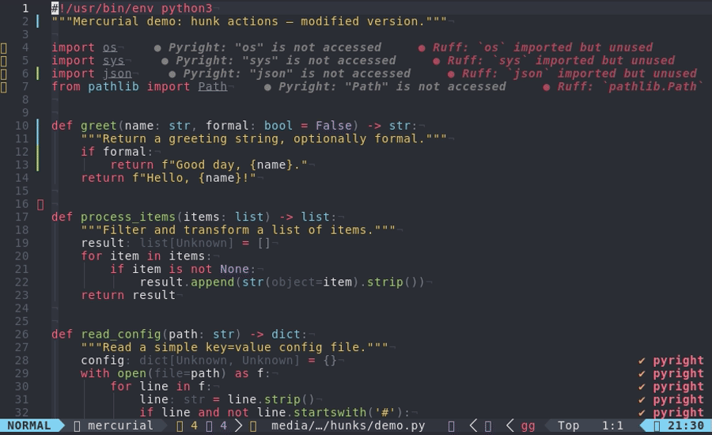
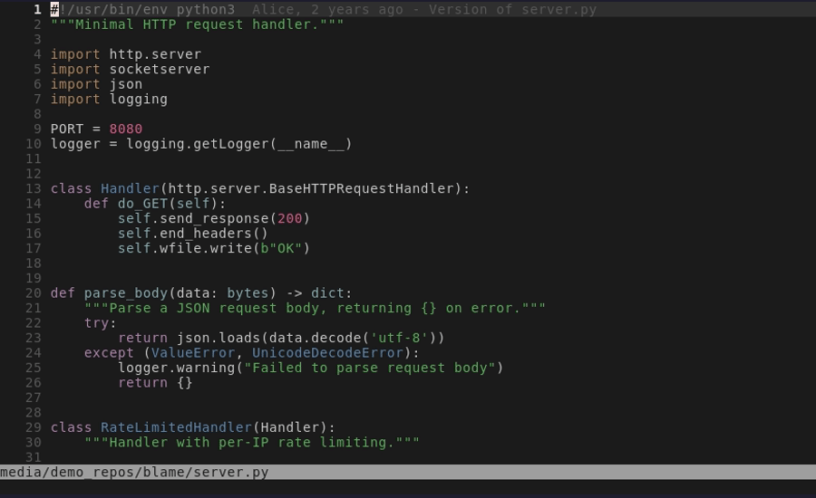

# hgsigns.nvim

[](https://github.com/lewis6991/hgsigns.nvim/actions?query=workflow%3ACI)
[](https://github.com/lewis6991/hgsigns.nvim/releases)
[](https://opensource.org/licenses/MIT)


Deep buffer integration for Mercurial

## 👀 Preview

| Hunk Actions | Line Blame |
| --- | ----------- |
|  |  |

## ✨ Features

<details>
  <summary><strong>Signs</strong></summary>

  - Adds signs to the sign column to indicate added, changed, and deleted lines.

    

  - Add counts to signs.

    


</details>

<details>
  <summary><strong>Hunk Actions</strong></summary>

  - Reset hunks with `:Hgsigns reset_hunk`.
  - Also works on partial hunks in visual mode.
  - Preview hunks inline with `:Hgsigns preview_hunk_inline`

    

  - Preview hunks in popup with `:Hgsigns preview_hunk`

    

  - Navigate between hunks with `:Hgsigns nav_hunk next/prev`.

</details>

<details>
  <summary><strong>Blame</strong></summary>

  - Show blame of current buffer using `:Hgsigns blame`.

    

  - Show blame information for the current line in popup with `:Hgsigns blame_line`.

    

  - Show blame information for the current line in virtual text.

    

    - Enable with `setup({ current_line_blame = true })`.
    - Toggle with `:Hgsigns toggle_current_line_blame`

</details>

<details>
  <summary><strong>Diff</strong></summary>

  - Change the revision for the signs with `:Hgsigns change_base <REVISION>`.
  - Show the diff of the current buffer with the working copy or any revision
    with `:Hgsigns diffthis <REVISION>`.
  - Show intra-line word-diff in the buffer.

    

    - Enable with `setup({ word_diff = true })`.
    - Toggle with `:Hgsigns toggle_word_diff`.

</details>

<details>
  <summary><strong>Show hunks Quickfix/Location List</strong></summary>

  - Set the quickfix/location list with changes with `:Hgsign setqflist/setloclist`.

    

    Can show hunks for:
    - whole repository (`target=all`)
    - attached buffers (`target=attached`)
    - a specific buffer (`target=[integer]`).

</details>

<details>
  <summary><strong>Text Object</strong></summary>

  - Select hunks as a text object.
  - Can use `vim.keymap.set({'o', 'x'}, 'ih', '<Cmd>Hgsigns select_hunk<CR>')`

</details>

<details>
  <summary><strong>Status Line Integration</strong></summary>

  Use `b:hgsigns_status` or `b:hgsigns_status_dict`. `b:hgsigns_status` is
  formatted using `config.status_formatter`. `b:hgsigns_status_dict` is a
  dictionary with the keys `added`, `removed`, `changed` and `head`.

  Example:
  ```viml
  set statusline+=%{get(b:,'hgsigns_status','')}
  ```

  For the current branch use the variable `b:hgsigns_head`.

</details>

<details>
  <summary><strong>Show different revisions of buffers</strong></summary>

  - Use `:Hgsigns show <REVISION>` to `:edit` the current buffer at `<REVISION>`

</details>

## 📋 Requirements

- Neovim >= 0.9.0

> [!TIP]
> If your version of Neovim is too old, then you can use a past [release].

> [!WARNING]
> If you are running a development version of Neovim (aka `master`), then
> breakage may occur if your build is behind latest.

- Newish version of hg. Older versions may not work with some features.

## 🛠️ Installation & Usage

Install using your package manager of choice. No setup required.

Optional configuration can be passed to the setup function. Here is an example
with most of the default settings:

```lua
require('hgsigns').setup {
  signs = {
    add          = { text = '┃' },
    change       = { text = '┃' },
    delete       = { text = '_' },
    topdelete    = { text = '‾' },
    changedelete = { text = '~' },
    untracked    = { text = '┆' },
  },
  signcolumn = true,  -- Toggle with `:Hgsigns toggle_signs`
  numhl      = false, -- Toggle with `:Hgsigns toggle_numhl`
  linehl     = false, -- Toggle with `:Hgsigns toggle_linehl`
  word_diff  = false, -- Toggle with `:Hgsigns toggle_word_diff`
  watch_gitdir = {
    follow_files = true
  },
  auto_attach = true,
  attach_to_untracked = false,
  current_line_blame = false, -- Toggle with `:Hgsigns toggle_current_line_blame`
  current_line_blame_opts = {
    virt_text = true,
    virt_text_pos = 'eol', -- 'eol' | 'overlay' | 'right_align'
    delay = 1000,
    ignore_whitespace = false,
    virt_text_priority = 100,
    use_focus = true,
  },
  current_line_blame_formatter = '<author>, <author_time:%R> - <summary>',
  sign_priority = 6,
  update_debounce = 100,
  status_formatter = nil, -- Use default
  max_file_length = 40000, -- Disable if file is longer than this (in lines)
  preview_config = {
    -- Options passed to nvim_open_win
    style = 'minimal',
    relative = 'cursor',
    row = 0,
    col = 1
  },
}
```

For information on configuring Neovim via lua please see [nvim-lua-guide].

### 🎹 Keymaps

Hgsigns provides an `on_attach` callback which can be used to setup buffer mappings.

Here is a suggested example:

```lua
require('hgsigns').setup{
  ...
  on_attach = function(bufnr)
    local hgsigns = require('hgsigns')

    local function map(mode, l, r, opts)
      opts = opts or {}
      opts.buffer = bufnr
      vim.keymap.set(mode, l, r, opts)
    end

    -- Navigation
    map('n', ']c', function()
      if vim.wo.diff then
        vim.cmd.normal({']c', bang = true})
      else
        hgsigns.nav_hunk('next')
      end
    end)

    map('n', '[c', function()
      if vim.wo.diff then
        vim.cmd.normal({'[c', bang = true})
      else
        hgsigns.nav_hunk('prev')
      end
    end)

    -- Actions
    map('n', '<leader>hr', hgsigns.reset_hunk)

    map('v', '<leader>hr', function()
      hgsigns.reset_hunk({ vim.fn.line('.'), vim.fn.line('v') })
    end)

    map('n', '<leader>hR', hgsigns.reset_buffer)
    map('n', '<leader>hp', hgsigns.preview_hunk)
    map('n', '<leader>hi', hgsigns.preview_hunk_inline)

    map('n', '<leader>hb', function()
      hgsigns.blame_line({ full = true })
    end)

    map('n', '<leader>hd', hgsigns.diffthis)

    map('n', '<leader>hD', function()
      hgsigns.diffthis('~')
    end)

    map('n', '<leader>hQ', function() hgsigns.setqflist('all') end)
    map('n', '<leader>hq', hgsigns.setqflist)

    -- Toggles
    map('n', '<leader>tb', hgsigns.toggle_current_line_blame)
    map('n', '<leader>tw', hgsigns.toggle_word_diff)

    -- Text object
    map({'o', 'x'}, 'ih', hgsigns.select_hunk)
  end
}
```

## 🔗 Plugin Integrations

### [trouble.nvim]

If installed and enabled (via `config.trouble`; defaults to true if installed), `:Hgsigns setqflist` or `:Hgsigns setloclist` will open Trouble instead of Neovim's built-in quickfix or location list windows.

## 🔌 Similar plugins

- [mini.diff]
- [coc-git]
- [vim-gitgutter]
- [vim-signify]

<!-- links -->
[mini.diff]: https://github.com/echasnovski/mini.diff
[coc-git]: https://github.com/neoclide/coc-git
[diff-linematch]: https://github.com/neovim/neovim/pull/14537
[luv]: https://github.com/luvit/luv/blob/master/docs.md
[nvim-lua-guide]: https://neovim.io/doc/user/lua-guide.html
[release]: https://github.com/lewis6991/hgsigns.nvim/releases
[trouble.nvim]: https://github.com/folke/trouble.nvim
[vim-fugitive]: https://github.com/tpope/vim-fugitive
[vim-gitgutter]: https://github.com/airblade/vim-gitgutter
[vim-signify]: https://github.com/mhinz/vim-signify
[virtual lines]: https://github.com/neovim/neovim/pull/15351
[lspsaga.nvim]: https://github.com/glepnir/lspsaga.nvim
